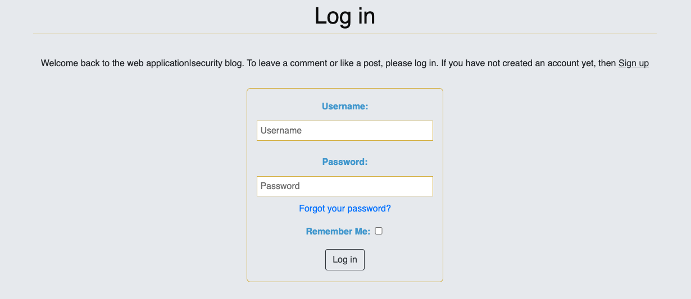
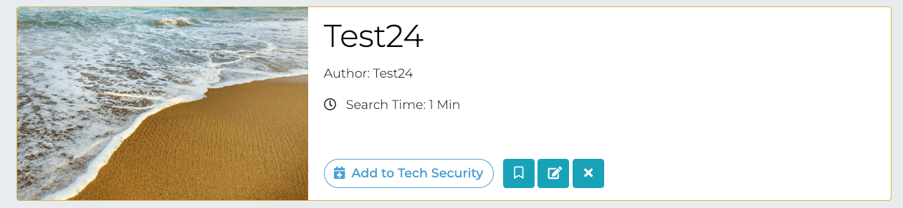
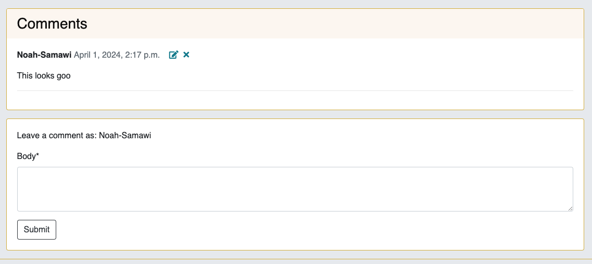

# The Web Application Security 

Welcome to the Web Application Security project repository! This project aims to provide resources, tools, and guidelines for improving the security of web applications. With the increasing number of cyber threats targeting web applications, it's essential to adopt best practices and techniques to mitigate risks and protect sensitive data.

The site acts as a repository for SecurityFeature whereby users can store their own SecurityFeature and also browse other users' SecurityFeature and bookmark them for a later date. Users can get organised for the week ahead by adding SecurityFeature to their tech security for each time. 

  
Developer: [Noah Al Samawi](https://github.com/Noah-Samawi)  
[Live webapp](https://pp4-web-application-security-aaef0fe6b0f0.herokuapp.com/)  
[Repository](https://github.com/Noah-Samawi/pp4-Web-Application-Security.git)  

## Table of Contents
- [The Tech Security](#the-tech-security)
  * [User Experience (UX)](#user-experience-ux)
    + [User Stories](#user-stories)
    + [Design](#design)
      - [Colour Scheme](#colour-scheme)
      - [Imagery](#imagery)
      - [Fonts](#fonts)
      - [Wireframes](#wireframes)
  * [Agile Methodology](#agile-methodology)
  * [Data Model](#data-model)
  * [Testing](#testing)
  * [Security Features and Defensive Design](#security-features-and-defensive-design)
    + [User Authentication](#user-authentication)
    + [Form Validation](#form-validation)
    + [Database Security](#database-security)
    + [Custom Error Pages](#custom-error-pages)
  * [Features](#features)
    + [Header](#header)
    + [Footer](#footer)
    + [Home Page](#home-page)
    + [User Account Pages](#user-account-pages)
    + [Browse SecurityFeatures](#browse-securityfeatures)
    + [SecurityFeature Detail Page](#securityfeature-detail-page)
    + [Add SecurityFeature Form](#add-securityfeature-form)
    + [Update SecurityFeature Form](#update-securityfeature-form)
    + [Delete SecurityFeature](#delete-securityfeature)
    + [My Tech Security](#my-tech-security)
    + [My SecurityFeatures Page](#my-securityfeatures-page)
    + [My Bookmarks Page](#my-bookmarks-page)
    + [Future Features](#future-features)
  * [Deployment - Heroku](#deployment---heroku)
  * [Forking this repository](#forking-this-repository)
  * [Cloning this repository](#cloning-this-repository)
  * [Languages](#languages)
  * [Frameworks - Libraries - Programs Used](#frameworks---libraries---programs-used)
  * [Credits](#credits)
  * [Resource_Links_Used](#resource-links-used)

  * [Acknowledgments](#acknowledgments)

<small><i><a href='http://ecotrust-canada.github.io/markdown-toc/'>Table of contents generated with markdown-toc</a></i></small>
## User Experience (UX)

Visitors to our Web Application Security platform are typically passionate about web security and eager to explore the latest security features. Whether you're a seasoned professional or just beginning to delve into the world of cybersecurity, our platform offers a wealth of resources and tools to help you stay informed and protected. Join our community of like-minded individuals and embark on a journey to strengthen your web security knowledge while discovering innovative security solutions.

### User Stories
:[2,](https://github.com/Noah-Samawi/pp4-Web-Application-Security/issues/2) [3,](https://github.com/Noah-Samawi/pp4-Web-Application-Security/issues/3) [18,](https://github.com/Noah-Samawi/pp4-Web-Application-Security/issues/18) [17,](https://github.com/Noah-Samawi/pp4-Web-Application-Security/issues/17) [16,](https://github.com/Noah-Samawi/pp4-Web-Application-Security/issues/16) [15,](https://github.com/Noah-Samawi/pp4-Web-Application-Security/issues/15) [14,](https://github.com/Noah-Samawi/pp4-Web-Application-Security/issues/14) [13,](https://github.com/Noah-Samawi/pp4-Web-Application-Security/issues/13) [12,](https://github.com/Noah-Samawi/pp4-Web-Application-Security/issues/12) [11,](https://github.com/Noah-Samawi/pp4-Web-Application-Security/issues/11) [10,](https://github.com/Noah-Samawi/pp4-Web-Application-Security/issues/10) [9,](https://github.com/Noah-Samawi/pp4-Web-Application-Security/issues/9)[8,](https://github.com/Noah-Samawi/pp4-Web-Application-Security/issues/8) [7,](https://github.com/Noah-Samawi/pp4-Web-Application-Security/issues/7) [6,](https://github.com/Noah-Samawi/pp4-Web-Application-Security/issues/6) [5,](https://github.com/Noah-Samawi/pp4-Web-Application-Security/issues/5) [4,](https://github.com/Noah-Samawi/pp4-Web-Application-Security/issues/4)
#### EPIC | User Profile
- As a site user, I can register an account to add, edit, or delete my security features, comment on, and bookmark other people's security features, and contribute to web application security.
- As a site user, I can log in or log out of my account to ensure the security of my account.
- As a site user, I can view my login status to determine whether I'm currently logged in or logged out.
- As a site user, I can reset my password if I forget it.

#### EPIC | User Navigation
- As a site user, I want to immediately understand the purpose of the site so that I can determine if it meets my needs.
- As a site user, I want to navigate around the site intuitively, enabling me to find content and understand my location within the site.
- As a site user, I want to view a paginated list of security features, allowing me to select a security feature to view.
- As a site user, I want to be able to click on a security feature to read its full details,
 including required Description and to view comments left by other users.

#### EPIC | SecurityFeature Management
- As a site user, I want to input my favorite security features into the app through an easy-to-use interface so that I can share them with other users.
- As a site user, I want to be able to edit and delete security features that I have created, enabling me to make changes easily without starting over.
- As a site user, I want to view my security features so that I can see and manage all the security features I have created in one location.
- As a site user, I want to view my bookmarked security features so that I can easily find them in one location.

#### EPIC | SecurityFeature Interaction
- As a site user, I want to save other users' security features to my bookmarks so that I can easily find them at a later date.
- As a site user, I want to be able to comment on other people's security features so that I can provide my feedback.
- As a site user, I want to edit and delete comments that I have created so that I can easily make changes if I have made a mistake.

#### EPIC | Site Administration
- As a Site Administrator, I can create, read, update and delete securityfeatures, comments, and tech securtiy items so that I can manage the app content.

### Design

The site features a deliberately simple and clean design, chosen to harmonize with its overarching goal: to evoke a sense of calmness in users and alleviate stress associated with everyday security checks.

#### Colour Scheme
Colour palette from Coolors

The colour scheme of the site is Anti Flash White, Night, Gunmetal and Gelesial Blue with thin gold borders. The colours chosen are quite neutral and calming. 

Night was taken to establish a good contrast between background colours and text at all times to ensure maximum user accessibility. 

#### Imagery
There are two static images on the site depicting a person walking across a computer to explain Web Application Security on the home page. The rest of the imagery will be uploaded by users for their individual security features.

#### Fonts
The main font used for the body of the website is sans-serif, while Playfair Display is used for the main headings on the home page. These fonts have been imported via Google Fonts. In the event that the main font fails to import correctly, Sans Serif serves as the backup font.

#### Wireframes

 
Landing Page

Browse SecurityFeature

## Agile Methodology

Github projects was used to manage the development process using an agile approach. Please see link to project board [here](https://github.com/users/Noah-Samawi/projects/12/views/1?layout=board)

The 6 Epics listed above were documented within the Github project as Milestones. A Github Issue was created for each User Story which was then allocated to a milestone(Epic). Each User Story has defined acceptance criteria to make it clear when the User Story has been completed. The acceptance criteria are further broken down into tasks to facilitate the User Story's execution.

## Data Model
I utilized Object-Oriented Programming principles extensively throughout this project, leveraging Django’s Class-Based Generic Views. Django AllAuth served as the user authentication system.

To enable users to create security features, a custom SecurityFeature model was implemented. The 'author' of a security feature is represented as a foreign key to the User model, as each security feature is associated with only one author.

The Comment model facilitates users' ability to comment on individual security features. A security feature is referenced as a foreign key in the Comment model, ensuring that each comment is linked to only one security feature.

Additionally, the SecurityFeature model allows users to add security features to a tech security for a specific day. Each tech security item is associated with one user and one security feature, achieved through foreign key relationships with the User and SecurityFeature models.

The diagram below details the database schema.

## Testing

Testing and results can be found [here](/TESTING.md)

## Security Features and Defensive Design

### User Authentication

- Django's LoginRequiredMixin is used to make sure that any requests to access secure pages by non-authenticated users are redirected to the login page. 
- Django's UserPassesTestMixin is used to limit access based on certain permissions i.e. to ensure users can only edit/delete securityfeatures and comments for which they are the author. If the user doesn't pass the test they are shown an HTTP 403 Forbidden error.

### Form Validation
If incorrect or empty data is added to a form, the form won't submit and a warning will appear to the user informing them what field raised the error. 

### Database Security
The database url and secret key are stored in the env.py file to prevent unwanted connections to the database and this was set up before the first push to Github.

Cross-Site Request Forgery (CSRF) tokens were used on all forms throughout this site.

### Custom error pages

Custom Error Pages were created to give the user more information on the error and to provide them with buttons to guide them back to the site.

- 400 Bad Request - The Tech Security is unable to handle this request.
- 403 Page Forbidden - Looks like you're trying to access forbidden content. Please log out and sign in to the correct account.
- 404 Page Not Found - The page you're looking for doesn't exist.
- 500 Server Error - The Tech Security is currently unable to handle this request

## Features

### Header

**Logo**
- A customized logo was created using HTML and CSS. The logo is linked to the home page for ease of navigation for the user.

**Navigation Bar**

- The navigation bar is present at the top of every page and includes all links to the various other pages.
- The My Account navigation link is a drop down menu which includes the Sign up and Log in links. 
- When the user has logged in, the My Account drop down menu changes to display the user's name and a profile icon.

- The options to Sign up or Log in will change to the option to log out once a user has logged in.
- Once a user has signed in, more options such as 'Add SecurityFeature', 'My Tech Security', 'My SecurityFeatures' and 'My Bookmarks' become available.
- The navigation bar is fully responsive, collapsing into a hamburger menu when the screen size becomes too small.
- Hovering over the links will lighten the font.

### Footer

- The footer section includes links to Facebook, Instagram, Twitter and Youtube.
- Clicking the links in the footer opens a separate browser tab to avoid pulling the user away from the site.

### Home Page

**Call to Action Section**

- The home page features a call-to-action section encouraging users to sign up for the site with the message "Take the stress out of everyday security!" accompanied by an image of web application security.
- Within the call-to-action section, there is a sign-up button that directs users to the sign-up page.
- If a user is already signed in, the message on the call-to-action section changes to 'Welcome back to The Work Safely,' and the user is prompted to create a new security feature.
- The sign-up button transforms into a 'Create' button, which, upon clicking, takes the user to the 'Add Security Feature' page.

**What We Do Section**

- The "What We Do' section gives a brief overview of what the site has to offer and summarises the basic features with three simple steps illustrated with font-awesome icons.

### User Account Pages

**Sign Up**

**Log In**

**Log Out**

- Django allauth was installed and used to create the Sign up, Log in and Log out functionality. 
- Success messages inform the user if they have logged in/ logged out successfully.

### Browse SecurityFeatures

- This page displays all securityfeatures with a status of published with the most recent securityfeatures displayed first.
- The securityfeature cards are paginated after every 8 securityfeatures.
- Each card displays the securityfeature's image, Title and Search Time.
- Clicking anywhere inside the securityfeature card will take you directly to that securityfeature's detailed page.

### SecurityFeatures Detail Page
**SecurityFeature Header Section**

The securityfeature header section at the top of the page shows the securityfeature image, title, author, prep time and searsh time.

**SecurityFeature Details Section**

- The main body of the page consists of the securityfeature description and method.

**Comments Section**

- The comments section lists all comments left by users for that particular securityfeature.
- Comments can only be left if a user is logged in. Any comments left by the user that is currently signed in can be updated or deleted using the buttons in the comment header.

omment.png) without being signed in they are redirected to the log in page.
- If a user tries to edit/delete another user's comment (by changing the url) they receive a custom 403 error.
### Add SecurityFeature Form

- If the user is logged in, then they can add a SecurityFeature by clicking the link on the navigation bar.
- The form fields for 'Description' and 'Method' include a WYSIWYG editor called Summernote to help the user format their content by adding bullet points, headings etc.
- The user can upload a photo if they wish. If they choose not to, a default image displays as their securityfeature image.
- The user can choose to publish the securityfeature now or save for later through a drop down menu. If they choose to 'save for later', the securityfeature will not appear on the Browse SecurityFeature page but the user will be able to access it in their 'My SecurityFeatures' page and it will be labelled as 'DRAFT'.
- Failing to fill out the securityfeature's Title, Description or Method, results in the form failing and rendering a message stating which fields you have missed.
- If a user tries to add a securityfeature (by changing the url) without being signed in they are redirected to the log in page.
- The user will receive a success message notifying them that the securityfeature has been successfully added.

### Update SecurityFeature Form

- If the user is logged in and is the author or the securityfeature they can choose to edit the securityfeature by clicking the edit button on the securityfeature detail page.
- The form opens with all fields populated with the original content.
- If a user tries to update a securityfeature (by changing the url) without being signed in they are redirected to the log in page.
- If a user tries to update another user's securityfeature (by changing the url) they receive a custom 403 error.
- The user will receive a success message notifying them that the securityfeature has been successfully updated.

### Delete SecurityFeature

 

- If the user is logged in and is the author or the recsecurityfeatureipe they can choose to delete the securityfeature by clicking the delete button on the securityfeature detail page.
- The user is asked to confirm if they wish to delete the securityfeature or cancel.
- The user will receive a success message notifying them that the securityfeature has been successfully deleted.

### My Tech Security

- This page displays the logged in user's tech security for the week.
- The tech security cards are ordered Monday to Sunday.
- If a user has added a securityfeauter to their tech security for a particular day, the card will display the securityfeauter image and title. Clicking anywhere inside the tech security card will take you directly to that securityfeauter's detailed page.
- If there is no tech security for a particular day, that card will display a plus icon and the text "Add SecurityFeauter". Clicking anywhere inside the tech security card will take you to the browse securityfeauter page.
- If a user tries to access this page (by changing the url) without being signed in they are redirected to the log in page.

### My SecurityFeatures Page

- This page displays all securityfeatures which the logged in user has created.
- The securityfeature cards are paginated after every 8 securityfeatures.
- Each card displays the securityfeature's image, Title and Search Time.
- If the securityfeature is not yet published the word 'DRAFT' will appear in red next to the securityfeature title.
- Clicking anywhere inside the securityfeatures card will take you directly to that securityfeature's detailed page.
- If a user tries to access this page (by changing the url) without being signed in they are redirected to the log in page.

### My Bookmarks Page

- This page displays all securityfeatures which the logged in user has added to their bookmarks.
- Clicking anywhere inside the securityfeatures card will take you directly to that securityfeature's detailed page.
- If a user tries to access this page (by changing the url) without being signed in they are redirected to the log in page.

### Future Features
The following user stories were scoped out of the project due to time constraints and labelled as "Could Have" on the project board in Github. It is intended that these user stories will be implemented at a later date.

## Deployment - Heroku

To deploy this page to Heroku from its GitHub repository, the following steps were taken:

### Create the Heroku App:
- Log in to [Heroku](https://dashboard.heroku.com/apps) or create an account.
- On the main page click the button labelled New in the top right corner and from the drop-down menu select "Create New App".
- Enter a unique and meaningful app name.
- Next select your region.
- Click on the Create App button.

### Attach the Postgres database:
- In the Resources tab, under add-ons, type in Postgres and select the Heroku Postgres option.
- Copy the DATABASE_URL located in Config Vars in the Settings Tab.

### Prepare the environment and settings.py file:
- In your GitPod workspace, create an env.py file in the main directory.
- Add the DATABASE_URL value and your chosen SECRET_KEY value to the env.py file.
- Update the settings.py file to import the env.py file and add the SECRETKEY and DATABASE_URL file paths.
- Comment out the default database configuration.
- Save files and make migrations.
- Add Cloudinary URL to env.py
- Add the cloudinary libraries to the list of installed apps.
- Add the STATIC files settings - the url, storage path, directory path, root path, media url and default file storage path.
- Link the file to the templates directory in Heroku.
- Change the templates directory to TEMPLATES_DIR
- Add Heroku to the ALLOWED_HOSTS list the format ['app_name.heroku.com', 'localhost']

### Create files / directories
- Create requirements.txt file
- Create three directories in the main directory; media, storage and templates.
- Create a file named "Procfile" in the main directory and add the following: web: gunicorn project-name.wsgi

### Update Heroku Config Vars
Add the following Config Vars in Heroku:
- SECRET_KEY value
- CLOUDINARY_URL
- PORT = 8000
- DISABLE_COLLECTSTATIC = 1

### Deploy
- NB: Ensure in Django settings, DEBUG is False
- Go to the deploy tab on Heroku and connect to GitHub, then to the required repository.
- Scroll to the bottom of the deploy page and either click Enable Automatic Deploys for automatic deploys or Deploy Branch to deploy manually. Manually deployed branches will need re-deploying each time the repo is updated.
- Click View to view the deployed site.

The site is now live and operational.

## Forking this repository
- Locate the repository at this link [The Tech Security](https://github.com/Noah-Samawi/pp4-Web-Application-Security.git).
- At the top of the repository, on the right side of the page, select "Fork" from the buttons available.
- A copy of the repository is now created.

## Cloning this repository
To clone this repository follow the below steps:

1. Locate the repository at this link [The Tech Security](https://github.com/Noah-Samawi/pp4-Web-Application-Security.git).
2. Under **'Code'**, see the different cloning options, HTTPS, SSH, and GitHub CLI. Click the prefered cloning option, and then copy the link provided.
3. Open **Terminal**.
4. In Terminal, change the current working directory to the desired location of the cloned directory.
5. Type **'git clone'**, and then paste the URL copied from GitHub earlier. 
6. Type **'Enter'** to create the local clone.

## Languages

- Python
- HTML
- CSS
- Javascript

## Frameworks - Libraries - Programs Used
- [Django](https://www.djangoproject.com/): Main python framework used in the development of this project
- [Django-allauth](https://django-allauth.readthedocs.io/en/latest/installation.html): authentication library used to create the user accounts
- [PostgreSQL](https://www.postgresql.org/) was used as the database for this project.
- [Heroku](https://dashboard.heroku.com/login) - was used as the cloud based platform to deploy the site on.
- [Responsinator](http://www.responsinator.com/) - Used to verify responsiveness of website on different devices.
- [Balsamiq](https://balsamiq.com/) - Used to generate Wireframe images.
- [Chrome Dev Tools](https://developer.chrome.com/docs/devtools/) - Used for overall development and tweaking, including testing responsiveness and performance.
- [Font Awesome](https://fontawesome.com/) - Used for icons in information bar.
- [GitHub](https://github.com/) - Used for version control and agile tool.
- [Google Fonts](https://fonts.google.com/) - Used to import and alter fonts on the page.
- [W3C](https://validator.w3.org/) - Used for HTML & CSS Validation.
- [PEP8 Online](http://pep8online.com/) - used to validate all the Python code
- [Jshint](https://jshint.com/) - used to validate javascript
- [Coolors](https://coolors.co/) - Used to create colour palette.
- [Favicon](https://favicon.io/) - Used to create the favicon.
- [Lucidchart](https://lucid.app/documents#/dashboard) - used to create the database schema design
- [Grammerly](https://app.grammarly.com/) - used to proof read the README.md
- [Summernote](https://summernote.org/): A WYSIWYG editor to allow users to edit their posts
- [Techsini](https://techsini.com/multi-mockup/index.php) - Site mockup generator
- [Crispy Forms](https://django-crispy-forms.readthedocs.io/en/latest/) used to manage Django Forms
- [Cloudinary](https://cloudinary.com/): the image hosting service used to upload images
- [Bootstrap 4.6](https://getbootstrap.com/docs/4.6/getting-started/introduction/): CSS Framework for developing responsiveness and styling
- [Hatchful](https://hatchful.shopify.com/): Used to generate custom logo
- [Tables Generator](https://www.tablesgenerator.com/markdown_tables): Used to convert excel testing tables to markdown
- [Tiny Png](https://tinypng.com/): Used to compressed Images to smaller sizes to create faster websites.

## Resource Links used

* https://cdnjs.com/libraries/bootstrap - CDN for bootstrap links
* https://getbootstrap.com/docs/5.2/getting-started/introduction - Bootstrap documentation
* https://uxwing.com/ - UX Wing icons
* https://django-allauth.readthedocs.io/en/latest/installation.html - Django-Allauth
* https://django-crispy-forms.readthedocs.io/en/latest/install.html - Crispy Forms
* https://pypi.org/project/django-reorder/ - Django Reordered
* https://docs.djangoproject.com/en/4.1/topics/class-based-views/mixins/ - Django Mixins
* https://cloudinary.com/ - Cloudinary
* https://django-ckeditor.readthedocs.io/en/latest/ - CKEditor
* https://www.w3schools.com/howto/howto_css_modals.asp - CSS Modal

## Credits

- [W3Schools](https://www.w3schools.com/)
- [Django Docs](https://docs.djangoproject.com/en/4.0/)
- [Bootstrap 4.6 Docs](https://getbootstrap.com/docs/4.6/getting-started/introduction/)
- [Stack Overflow](https://stackoverflow.com/)
- [Pexels](https://www.pexels.com/): All imagery on the site was sourced from Pexels.com
- [Update View](https://pytutorial.com/django-updateview-example)
- [Pagination](https://docs.djangoproject.com/en/2.2/topics/pagination/#using-paginator-in-a-view)
- [AutoSlugField](https://django-extensions.readthedocs.io/en/latest/field_extensions.html)
- [Code Institute - Blog Walkthrough Project](https://github.com/Code-Institute-Solutions/Django3blog)
- [Ian Meigh - Custom Validator function](worksifly/validators.py)
- Security Feature information was generated by [Chat GPT-3.5](https://chat.openai.com/chat)

## Acknowledgments
I would like to express my gratitude to Code Institute's project "LMS Program" as it served as a significant source of inspiration for my own project. I am also incredibly thankful to my mentor, Antonio Rodriguez, for providing guidance and valuable feedback throughout the development process. Additionally, I extend my appreciation to Kay Welfare for being readily available, offering support, and providing assistance whenever needed. I am also incredibly thankful to the Tutor Assistance Support for helping me fix the defective bugs in my project. Their contributions have been essential in the successful completion of this project.