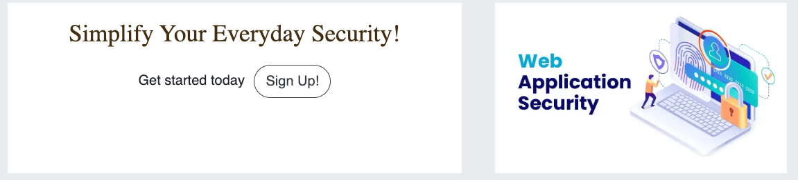

# The Web Application Security 
# Web Application Security

Welcome to the Web Application Security project repository! This project aims to provide resources, tools, and guidelines for improving the security of web applications. With the increasing number of cyber threats targeting web applications, it's essential to adopt best practices and techniques to mitigate risks and protect sensitive data.

The site acts as a repository for SecurityFeature whereby users can store their own SecurityFeature and also browse other users' SecurityFeature and bookmark them for a later date. Users can get organised for the week ahead by adding SecurityFeature to their tech security for each time. 

The live link can be found here - [The Web Application Security](https://pp4-web-application-security.herokuapp.com/)

## Table of Contents

- [The Easy Eater](#the-easy-eater)
  * [User Experience (UX)](#user-experience-ux)
    + [User Stories](#user-stories)
    + [Design](#design)
      - [Colour Scheme](#colour-scheme)
      - [Imagery](#imagery)
      - [Fonts](#fonts)
      - [Wireframes](#wireframes)
  * [Agile Methodology](#agile-methodology)
  * [Data Model](#data-model)
  * [Testing](#testing)
  * [Security Features and Defensive Design](#security-features-and-defensive-design)
    + [User Authentication](#user-authentication)
    + [Form Validation](#form-validation)
    + [Database Security](#database-security)
    + [Custom error pages:](#custom-error-pages-)
  * [Features](#features)
    + [Header](#header)
    + [Footer](#footer)
    + [Home Page](#home-page)
    + [User Account Pages](#user-account-pages)
    + [Browse SecurityFeatures](#browse-securityfeatures)
    + [SecurityFeature Detail Page](#securityfeature-detail-page)
    + [Add SecurityFeature Form](#add-securityfeature-form)
    + [Update SecurityFeature Form](#update-securityfeature-form)
    + [Delete SecurityFeature](#delete-securityfeature)
    + [My Tech Security](#my-tech-security)
    + [My SecurityFeatures Page](#my-securityfeatures-page)
    + [My Bookmarks Page](#my-bookmarks-page)
    + [Error Pages](#error-pages)
    + [Future Features](#future-features)
  * [Deployment - Heroku](#deployment---heroku)
  * [Forking this repository](#forking-this-repository)
  * [Cloning this repository](#cloning-this-repository)
  * [Languages](#languages)
  * [Frameworks - Libraries - Programs Used](#frameworks---libraries---programs-used)
  * [Credits](#credits)
  * [Acknowledgments](#acknowledgments)

<small><i><a href='http://ecotrust-canada.github.io/markdown-toc/'>Table of contents generated with markdown-toc</a></i></small>
## User Experience (UX)

Visitors to our Web Application Security platform are typically adults who are passionate about web security and eager to explore the latest security features. Whether you're a seasoned professional or someone just beginning to delve into the world of cybersecurity, our platform offers a wealth of resources and tools to help you stay informed and protected. Join our community of like-minded individuals and embark on a journey to strengthen your web security knowledge while discovering innovative security solutions.

### User Stories

#### EPIC | User Profile
- As a site user, I can register an account to add, edit, or delete my security features, comment on, and bookmark other people's security features, and contribute to web application security.
- As a site user, I can log in or log out of my account to ensure the security of my account.
- As a site user, I can view my login status to determine whether I'm currently logged in or logged out.

#### EPIC | User Navigation
- As a site user, I want to immediately understand the purpose of the site so that I can determine if it meets my needs.
- As a site user, I want to navigate around the site intuitively, enabling me to find content and understand my location within the site.
- As a site user, I want to view a paginated list of security features, allowing me to select a security feature to view.
- As a site user, I want to be able to click on a security feature to read its full details, including required ingredients, and to view comments and like left by other users.

#### EPIC | SecurityFeature Management
- As a site user, I want to input my favorite security features into the app through an easy-to-use interface so that I can share them with other users.
- As a site user, I want to be able to edit and delete security features that I have created, enabling me to make changes easily without starting over.
- As a site user, I want to view my security features so that I can see and manage all the security features I have created in one location.
- As a site user, I want to view my bookmarked security features so that I can easily find them in one location.

#### EPIC | SecurityFeature Interaction
- As a site user, I want to save other users' security features to my bookmarks so that I can easily find them at a later date.
- As a site user, I want to be able to comment and like on other people's security features so that I can provide my feedback.
- As a site user, I want to edit and delete comments and like that I have created so that I can easily make changes if I have made a mistake.

#### EPIC | Site Administration
- As a Site Administrator, I can create, read, update and delete securityfeatures, comments, like and tech securtiy items so that I can manage the app content.

### Design

The site features a deliberately simple and clean design, chosen to harmonize with its overarching goal: to evoke a sense of calmness in users and alleviate stress associated with everyday security checks.

#### Colour Scheme
Colour palette from Coolors

The colour scheme of the site is Anti Flash White, Night, Gunmetal and Gelesial Blue with thin gold borders. The colours chosen are quite neutral and calming. 

Night was taken to establish a good contrast between background colours and text at all times to ensure maximum user accessibility. 

#### Imagery
There is tow static images on the site depicting a family dinner on the home page. The rest of the imagery will be uploaded by users for their individual securityfeatures. 

#### Fonts
The main font used for the body of the website is sans-serif, while Playfair Display is used for the main headings on the home page. These fonts have been imported via Google Fonts. In the event that the main font fails to import correctly, Sans Serif serves as the backup font.

#### Wireframes

 
Landing Page

Browse SecurityFeature

Add SecurityFeature

My SecurityFeature

My Bookmarks

## Agile Methodology

Github projects was used to manage the development process using an agile approach. Please see link to project board [here](https://github.com/users/Noah-Samawi/projects/12/views/1?layout=board)

The 6 Epics listed above were documented within the Github project as Milestones. A Github Issue was created for each User Story which was then allocated to a milestone(Epic). Each User Story has defined acceptance criteria to make it clear when the User Story has been completed. The acceptance criteria are further broken down into tasks to facilitate the User Story's execution.

## Data Model
I utilized Object-Oriented Programming principles extensively throughout this project, leveraging Django’s Class-Based Generic Views. Django AllAuth served as the user authentication system.

To enable users to create security features, a custom SecurityFeature model was implemented. The 'author' of a security feature is represented as a foreign key to the User model, as each security feature is associated with only one author.

The Comment model facilitates users' ability to comment on individual security features. A security feature is referenced as a foreign key in the Comment model, ensuring that each comment is linked to only one security feature.

Additionally, the SecurityFeature model allows users to add security features to a tech security for a specific day. Each tech security item is associated with one user and one security feature, achieved through foreign key relationships with the User and SecurityFeature models.

The diagram below details the database schema.

## Security Features and Defensive Design

### User Authentication

- Django's LoginRequiredMixin is used to make sure that any requests to access secure pages by non-authenticated users are redirected to the login page. 
- Django's UserPassesTestMixin is used to limit access based on certain permissions i.e. to ensure users can only edit/delete securityfeatures and comments for which they are the author. If the user doesn't pass the test they are shown an HTTP 403 Forbidden error.

### Form Validation
If incorrect or empty data is added to a form, the form won't submit and a warning will appear to the user informing them what field raised the error. 

### Database Security
The database url and secret key are stored in the env.py file to prevent unwanted connections to the database and this was set up before the first push to Github.

Cross-Site Request Forgery (CSRF) tokens were used on all forms throughout this site.

### Custom error pages:

Custom Error Pages were created to give the user more information on the error and to provide them with buttons to guide them back to the site.

- 400 Bad Request - The Easy Eater is unable to handle this request.
- 403 Page Forbidden - Looks like you're trying to access forbidden content. Please log out and sign in to the correct account.
- 404 Page Not Found - The page you're looking for doesn't exist.
- 500 Server Error - The Easy Eater is currently unable to handle this request

## Features

### Header

**Logo**
- A customised logo was created using Hatchful by Shopify which is a free logo generator.
- This logo is positioned in the top left of the navigation bar. The logo is linked to the home page for ease of navigation for the user.

**Navigation Bar**

- The navigation bar is present at the top of every page and includes all links to the various other pages.
- The My Account navigation link is a drop down menu which includes the Sign up and Log in links. 
- When the user has logged in, the My Account drop down menu changes to display the user's name and a profile icon.

- The options to Sign up or Log in will change to the option to log out once a user has logged in.
- Once a user has signed in, more options such as 'Add SecurityFeature', 'My Tech Security', 'My SecurityFeatures' and 'My Bookmarks' become available.
- The navigation bar is fully responsive, collapsing into a hamburger menu when the screen size becomes too small.
- Hovering over the links will lighten the font.

### Footer

- The footer section includes links to Facebook, Instagram, Twitter and Youtube.
- Clicking the links in the footer opens a separate browser tab to avoid pulling the user away from the site.

### Home Page

**Call to Action Section**

- The home page includes a call to action section which encourages the user to sign up to the site with the message "Take the stress out of everyday cooking!" and an image of a family dinner.
- The CTA includes a sign up button which takes the user to the sign up page.
- If a user is already signed in the message changes to 'Welcome back to The Easy Eater' and the user is encouraged to create a new securityfeature.
- The sign up button changes to a 'Create' button which takes the user to the 'Add securityfeature' page. 

