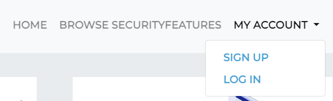
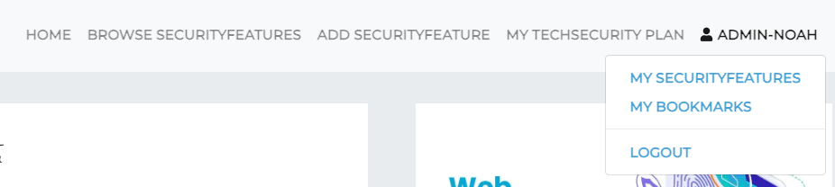
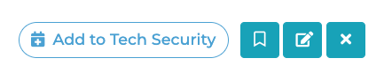
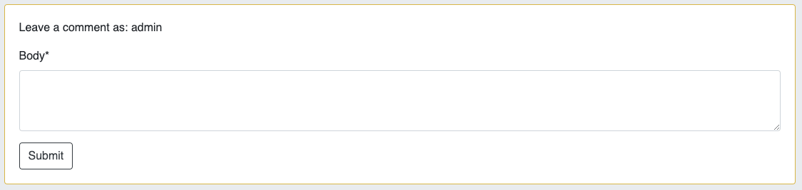
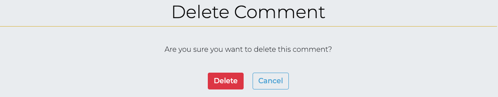
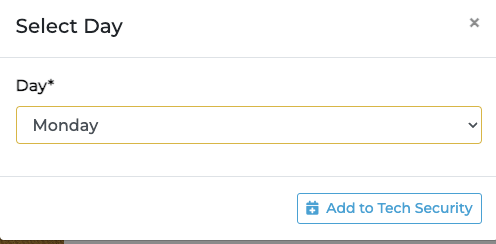
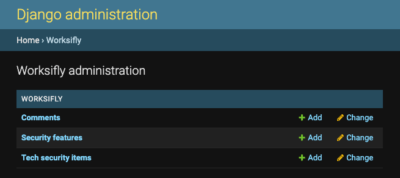
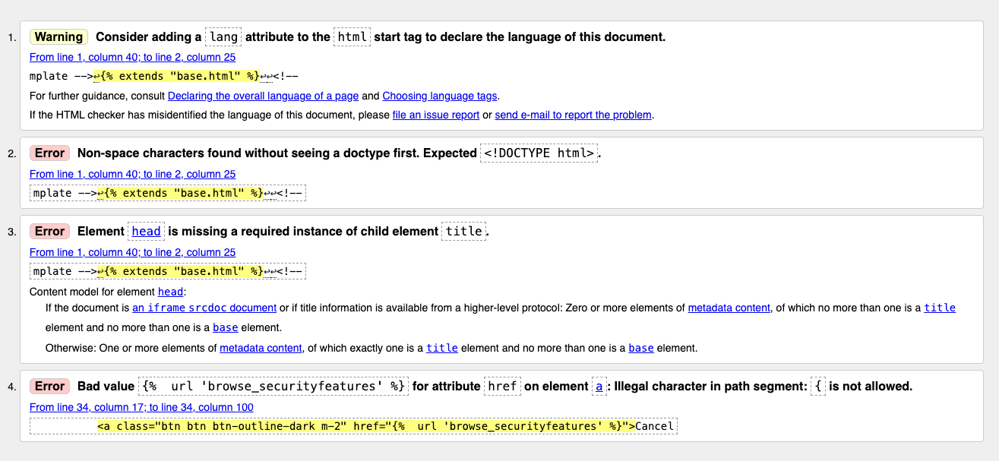
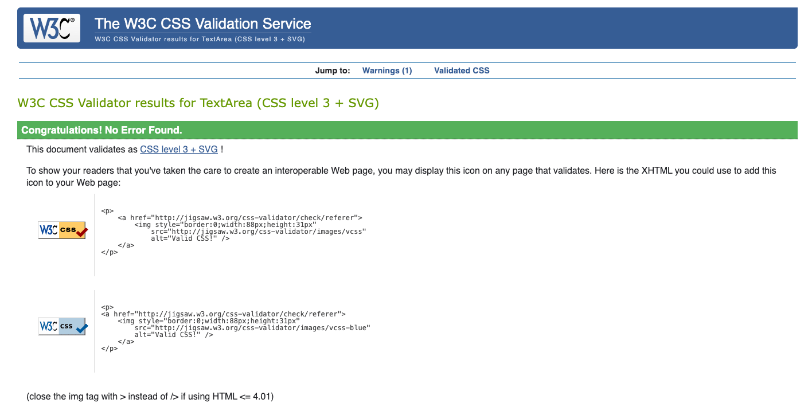
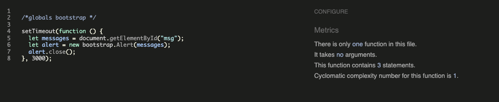

# Table of Contents
- [User Story Testing](#user-story-testing)
- [Validator Testing](#validator-testing)
  * [HTML](#html)
    + [Fixed Errors](#fixed-errors)
    + [Unfixed Errors](#unfixed-errors)
  * [CSS](#css)
  * [Javascript](#javascript)
  * [Python](#python)
  * [Lighthouse](#lighthouse)
- [Browser Testing](#browser-testing)
- [Device Testing](#device-testing)
- [Manual Testing](#manual-testing)
  * [Site Navigation](#site-navigation)
  * [Home Page](#home-page)
  * [Browse Securityfeatures Page](#browse-securityfeatures-page)
  * [Securityfeature Detail Page](#securityfeature-detail-page)
  * [Add Securityfeature Page](#add-securityfeature-page)
  * [Update Securityfeature Page](#update-securityfeature-page)
  * [Confirm Delete Securityfeature Page](#confirm-delete-securityfeature-page)
  * [My Securityfeatures Page](#my-securityfeatures-page)
  * [My Bookmarks Page](#my-bookmarks-page)
  * [My Techsecurity Plan Page](#my-techsecurity-plan-page)
  * [Django All Auth Pages](#django-all-auth-pages)
- [Bugs](#bugs)
  * [Fixed Bugs](#fixed-bugs)
    + [Overwrite Techsecurity Plan Items](#overwrite-techsecurity-plan-items)
    + [Required fields using Summernote extension submit with just whitespace entered](#required-fields-using-summernote-extension-submit-with-just-whitespace-entered)
    + [No Reverse Match Error](#no-reverse-match-error)
    + [Cloudinary Images not Displaying](#cloudinary-images-not-displaying)
    + [Footer not staying at bottom of screen](#footer-not-staying-at-bottom-of-screen)
  * [Unfixed bugs:](#unfixed-bugs-)

<small><i><a href='http://ecotrust-canada.github.io/markdown-toc/'>Table of contents generated with markdown-toc</a></i></small>

## User Story Testing

### EPIC | User Profile
*As a Site User I can register an account so that I can add/edit/delete my securityfeatures and comment on and bookmark other people's securityfeatures and add securityfeatures to my techsecurity planner.*

- A sign up button is immediately visible on the landing page as a call to action for the user to sign up to get started. When the user clicks the button they are taken to the sign up page.
- There is also a sign up button in the My Account drop down menu in the Nav bar.

- Once the user has registered an account they can perform all the actions listed above.

*As a Site User, I can login or logout of my account so that I can keep my account secure.*
- If the user has registered an account they can access the login and logout buttons in the My Account section of the Navbar. 

*As a Site User I can see my login status so that I know if I'm logged in or out.*
- Once the user has logged into their account their username displays on the Navbar beside a profile icon.

### EPIC | User Navigation
 *As a User I can immediately understand the purpose of the site so that I can decide if it meets my needs*
- In the centre of the landing page there is a section entitled "What We Do' which gives a brief overview of what the site has to offer and summarises the basic features with three simple steps illustrated with font-awesome icons.

*As a user, I can intuitively navigate around the site so that I can find content*
- A navigation bar is visible on every page of the site which is fully responsive on different screen sizes.

*As a Site User, I can view a paginated list of securityfeatures so that I can select a securityfeature to view.*
- The Browse Securityfeatures page displays a paginated list of all securityfeatures in the database with a status of published. 

*As a Site User, I can click on a securityfeature so that I can read the full securityfeature, ingredients required and view comments left by users.*
- Clicking anywhere inside the securityfeature card will take you directly to that securityfeature's detailed page which displays the full securityfeature details including description and method. 

- A list of comments is displayed underneath the securityfeatures details.

### EPIC | Securityfeature Management
*As a Site User, I can input my favourite securityfeatures onto the app through an easy to use interface so that I can share them with other users.*
- Once the user has logged in, a create securityfeature button is immediately visible on the landing page as a call to action for the user to add a securityfeature. When the user clicks the button they are taken to the add securityfeature form.

- There is also an 'Add Securityfeature' button on the Nav bar which is visible on every page.

- Once the user has filled out the form details they can choose to 'Publish Securityfeature Now' which adds the securityfeature to the Browse Securityfeatures page.

*As a Site User, I can edit and delete securityfeatures that I have created so that I can easily make changes without having to start over.*
- If the logged in user is the securityfeature author, edit and delete securityfeature icon buttons will display on the securityfeature detail page for each securityfeature allowing the user to edit and delete their securityfeatures.

*As a Site User, I can view my securityfeatures so that I can see and manage all securityfeatures I have created in the one location.*
- All the user's created securityfeatures are available to see on the 'My Securityfeatures' page.

*As a Site User, I can view my bookmarked securityfeatures so I can find them easily in the one location.*
- All the user's bookmarked securityfeatures are available to see on the 'My Bookmarks' page.

-

### EPIC | Securityfeature Interaction
*As a Site User, I can save other users' securityfeatures to my bookmarks so that I can find them easily at a later date.*
- Each securityfeatures has a bookmark button which can be toggled by signed in users to bookmark the securityfeature or remove from bookmarks.

*As a Site User, I can comment on other people's securityfeatures so I can give my feedback.*
- Each securityfeature has a comment section where logged in users can leave comments on the securityfeature.

*As a Site User, I can edit and delete comments that I have created so that I can easily make changes if I have made a mistake.*
- If the logged in user is the comment author, edit and delete icon buttons will display in the comment header allowing the user to edit or delete their comments.

### EPIC | Techsecurity  Management
*As a Site User, I can add/delete securityfeatures to my techsecurity planner for a particular day of the week so that I can create a techsecurity plan for the week ahead.*
- Each securityfeature has an 'Add to techsecurity Plan' button which only displays if the user is logged in.

 

- The user can choose which day of the week they want to add the securityfeature through a drop down menu.
- The securityfeature will display in the user's techsecurity plan for the day selected.

*As a Site User, I can view my techsecurity plan for the week when I log into my account so that I can plan for the week ahead.*
- All the user's techsecurity plan items are available to see on the 'My Techsecurity Plan' page.

### EPIC | Site Administration
*As a Site Administrator, I can create, read, update and delete securityfeatures, comments and techsecurity plan items so that I can manage the app content*
-  Admins have full access to CRUD functionality for all securityfeatures, comments and techsecurity plans in the admin panel.

## Validator Testing

### HTML

All HTML pages were run through the [W3C HTML Validator](https://validator.w3.org/). See results in below table.

| Page                          | Logged Out | Logged In |
|-------------------------------|------------|-----------|
| add_securityfeature.html      | N/A        | Note 1    |
| base.html                     | No errors  | No errors |
| browse_securityfeatures.html  | No errors  | No errors |
| delete_comment.html           | N/A        | No errors |
| delete_securityfeatures.html  | N/A        | No errors |
| index.html                    | No errors  | No errors |
| my_bookmarks.html             | N/A        | No errors |
| my_techsecurity.html          | N/A        | No errors |
| my_securityfeatures.html      | N/A        | No errors |
| paginator.html                | No errors  | No errors |
| securityfeature_detail.html   | No errors  | No errors |
| update_comment.html           | N/A        | No errors |
| update_securityfeature.html   | N/A        | Note 1    |
| login.html                    | No errors  | N/A       |
| logout.html                   | N/A        | No errors |
| signup.html                   | No errors  | N/A       |
| password_reset.html           | No errors  | N/A       |
| 400.html                      | No errors  | No errors |
| 403.html                      | N/A        | No errors |
| 404.html                      | No errors  | No errors |
| 500.html                      | No errors  | No errors |

#### Note 1: Summernote Errors
When validating the Add Securityfeature and Edit Securityfeature forms I received a number of errors which were caused by the installed Summernote library which runs when using the form on these pages. I could not rectify these errors given that they weren't in my own code therefore they are unresolved. 

 

 
Summernote Errors

 

#### Fixed Errors
When validating the Securityfeature Detail page I received an error in relation to an extra `
` tag in the 'Securityfeature Method' field which had been created using the summernote editor. The issue was due to Summernote including `
` tags around the form field. I resolved the error by removing the surrounding `
` tags in my HTML when rendering a summernote field in my Securityfeature Detail page.

### CSS
No errors were found when passing my CSS file through the official [W3C CSS Validator](https://jigsaw.w3.org/css-validator/)

 

 
CSS

 

### Javascript
No errors were found when passing my javascript through [Jshint](https://jshint.com/) 

Jshint

### Python
All Python files were run through [Pep8](http://pep8online.com/) with no errors found. 

### Lighthouse

Lighthouse validation was run on all pages (both mobile and desktop) in order to check accessibility and performance. At first I received the warning *'Background and foreground colors do not have a sufficient contrast ratio'* in relation to buttons where I had used the Bootstrap class `btn-info`. After I updated the button styling I received the below scores. 

| Page                    | Performance  | Accessibility | Best Practices  | SEO |
|-------------------------|:------------:|:-------------:|:---------------:|:---:|
|                         |              |               |                 |     |
| Desktop                 |              |               |                 |     |
| Home                    |           87 |           100 |             100 | 100 |
| Browse Securityfeatures |           89 |           100 |             100 | 100 |
| Securityfeature Detail  |           97 |            99 |             100 | 100 |
| Add Securityfeature     |           89 |            98 |             100 | 100 |
| My Securityfeature      |           89 |           100 |             100 | 100 |
| My Bookmarks            |           89 |           100 |             100 | 100 |
| My Techsecurity Plan    |           89 |           100 |             100 | 100 |
| Update Securityfeature  |           89 |            98 |             100 | 100 |
| Delete Securityfeature  |           89 |           100 |             100 | 100 |
| Update Comment.         |           89 |           100 |             100 | 100 |
| Delete Comment.         |           89 |           100 |             100 | 100 |
| Login                   |           89 |           100 |             100 | 100 |
| Logout                  |           89 |           100 |             100 | 100 |
| Signup                  |           99 |           100 |             100 | 100 |
| Password Rest           |           99 |           100 |             100 | 100 |
| Change Password         |           99 |           100 |             100 | 100 |
|                         |              |               |                 |     |
| Mobile                  |              |               |                 |     |
| Home                    |           94 |           100 |             100 | 100 |
| Browse Securityfeatures |           94 |           100 |             100 | 100 |
| Securityfeature Detail  |           93 |            98 |             100 | 100 |
| Add Securityfeature     |           86 |            98 |             100 | 100 |
| My Securityfeatures     |           94 |           100 |             100 | 100 |
| My Bookmarks            |           95 |           100 |             100 | 100 |
| My Techsecurity Plan    |           95 |           100 |             100 | 100 |
| Update Securityfeature  |           83 |            98 |             100 | 100 |
| Delete Securityfeature  |           94 |           100 |             100 | 100 |
| Update Comment.         |           94 |           100 |             100 | 100 |
| Delete Comment          |           94 |           100 |             100 | 100 |
| Login                   |           95 |           100 |             100 | 100 |
| Logout                  |           95 |           100 |             100 | 100 |
| Signup                  |           95 |           100 |             100 | 100 |
| Password Rest           |           99 |           100 |             100 | 100 |
| Change Password         |           99 |           100 |             100 | 100 |

## Browser Testing
- The Website was tested on Google Chrome, Firefox, Safari browsers with no issues noted.
    
## Device Testing
- The website was viewed on a variety of devices such as Desktop, Laptop, iPhone 8, iPhoneXR and iPad to ensure responsiveness on various screen sizes in both portrait and landscape mode. The website performed as intended. The responsive design was also checked using Chrome developer tools across multiple devices with structural integrity holding for the various sizes.

## Manual Testing

### Site Navigation
| Element                        | Action     | Expected Result                                                    | Pass/Fail |
|--------------------------------|------------|--------------------------------------------------------------------|-----------|
| NavBar                           |            |                                                                    |           |
| Site Name (logo area).         | Click      | Redirect to home                                                   | Pass      |
| Home Link                      | Click      | Redirect to home                                                   | Pass      |
| Browse Securityfeatures Link   | Click      | Open Browse Securityfeatures Page                                  | Pass      |
| Add Securityfeature Link       | Click      | Open Add Securityfeature Form                                      | Pass      |
| Add Securityfeature Link       | Display    | Only visible if user in session                                    | Pass      |
| My Techsecurity Plan Link      | Click      | Open My Techsecurity Plan page                                             | Pass      |
| My Techsecurity Plan Link      | Display    | Only visible if user in session                                    | Pass      |
| My Account Dropdown            | Click      | Open My Account dropdown                                           | Pass      |
| My Account Dropdown            | Display    | Text changes to username with profile icon when user is in session | Pass      |
| Sign Up Link                   | Click      | Open Sign up page                                                  | Pass      |
| Sign Up Link                   | Display    | Not visible if user in session                                     | Pass      |
| Log In Link                    | Click      | Open Login page                                                    | Pass      |
| Log In Link                    | Display    | Not visible if user in session                                     | Pass      |
| My Securityfeatures Link       | Click      | Open My Securityfeatures page                                      | Pass      |
| My Securityfeatures Link       | Display    | Only visible if user in session                                    | Pass      |
| My Bookmarks Link              | Click      | Open My Bookmarks page                                             | Pass      |
| My Bookmarks Link              | Display    | Only visible if user in session                                    | Pass      |
| Logout Link                    | Click      | Open logout confirm page                                           | Pass      |
| Logout Link                    | Display    | Only visible if user in session                                    | Pass      |
| All Nav Links                  | Hover      | lighten text                                                       | Pass      
|                                |            |                                                                    |           |
| Mobile View                    |            |                                                                    |           |
| Site Name (logo area)          | Click      | Redirect to home                                                   | Pass      |
| Home Link                      | Click      | Redirect to home                                                   | Pass      |
| Browse Securityfeatures Link   | Click      | Open Browse Securityfeatures Page                                  | Pass      |
| Sign Up Link                   | Click      | Open Sign up page                                                  | Pass      |
| Sign Up Link                   | Display    | Not visible if user in session                                     | Pass      |
| Log In Link                    | Click      | Open Login page                                                    | Pass      
| Log In Link                    | Display    | Not visible if user in session                                     | Pass      |
| Add Securityfeature Link       | Click      | Open Add Securityfeature Form                                      | Pass      |
| Add Securityfeature Link       | Display    | Only visible if user in session                                    | Pass      |
| My Techsecurity Plan Link      | Click      | Open My Techsecurity Plan page                                     | Pass      |
| My Securityfeatures Link       | Click      | Open My Securityfeatures page                                      | Pass      |
| My Securityfeatures Link       | Display    | Only visible if user in session                                    | Pass      |
| My Bookmarks Link              | Click      | Open My Bookmarks page                                             | Pass      |
| My Bookmarks Link              | Display    | Only visible if user in session                                    | Pass      |
| Logout Link                    | Click      | Open logout confirm page                                           | Pass      |
| Logout Link                    | Display    | Only visible if user in session                                    | Pass      |
|                                |            |                                                                    |           |
| Footer                         |            |                                                                    |           |
| All links                      | Click      | Open in new tab and to correct location                            | Pass      |

### Home Page
| Element               | Action  | Expected Result                 | Pass/Fail |
|-----------------------|---------|---------------------------------|-----------|
| Hero 'Sign Up' Button | Click   | Open Sign up page               | Pass      |
| Hero 'Sign Up' Button | Display | Not visible if user in session  | Pass      |
| Hero 'Create" Button  | Click   | Open Add Securityfeature page   | Pass      |
| Hero 'Create" Button  | Display | Only visible if user in session | Pass      |

### Browse Securityfeatures Page
| Element     | Action                  | Expected Result                                                                         | Pass/Fail |
|-------------|-------------------------|-----------------------------------------------------------------------------------------|-----------|
| Securityfeature Card | Display correct content | Display correct image, securityfeature and title                               
| Pass      |
| Securityfeature Card | Click                   | Clicking anywhere inside the securityfeature card takes you to the correct securityfeature's detail page. | Pass    |
| Securityfeature Card | Pagination              | Site will paginate 8 securityfeature cards to a page                                             | Pass      |
| Securityfeature Card | Order                   | Securityfeatures are sorted by newe oldest                                              | Pass      |
| Securityfeature Card | Hover                   | Add gold border                                                                         | Pass      |
### Securityfeature Detail Page

| Element                        | Action              | Expected Result                                                                                                         | Pass/Fail |
|--------------------------------|---------------------|-------------------------------------------------------------------------------------------------------------------------|-----------|
| Securityfeature Content        | Display             | Display correct securityfeature image, title, author, search time, description and method                    | Pass      |
| Add to Techsecurity Plan button        | Click               | Techsecurity Plan modal pops up                                                                                                 | Pass      |
| Add to Techsecurity Plan button        | Display             | Button only visible if user in session                                                                                  | Pass      |
| Bookmark button (Outline)      | Click               | Clicking the outlined bookmark changes it to a solid bookmark                                                           | Pass      |
| Bookmark button (Outline)      | Click               | Securityfeature is added to the user's bookmarks page                                                                            | Pass      |
| Bookmark button (Outline)      | Click               | Success message appears informing the user that the securityfeature has been added to their bookmarks                            | Pass            |
| Bookmark button (Outline)      | Click               | Success message fades after 3 seconds                                                                                   | Pass      |
| Bookmark button (Solid)        | Click               | Clicking the solid bookmark changes it back to an outlined bookmark                                                     | Pass      |
| Bookmark button (Solid)        | Click               | Securityfeature is removed from the user's bookmarks page                                                                        | Pass      |
| Bookmark button (Solid)        | Click               | Success message appears informing the user that the securityfeature has been removed from bookmarks                              | Pass      |
| Bookmark button (Solid)        | Click               | Success message fades after 3 seconds                                                                                   | Pass      |
| Bookmark button                | Display             | Button only visible if user in session                                                                                  | Pass      |
| Update securityfeature button           | Click               | Opens Update Securityfeature Form                                                                                                | Pass      |
| Update securityfeature button           | Display             | Button only visible if user is the author                                                                               | Pass      |
| Delete securityfeature button           | Click               | Opens Delete Securityfeature confirmation page                                                                                   | Pass      |
| Delete securityfeature button           | Display             | Button only visible if user is the author                                                                               | Pass      |
| User Comments                  | Display             | Displays correct name date time and comment body                                                                        | Pass      |
| User Comments                  | Display             | Comments are ordered oldest to newest                                                                                   | Pass      |
| Update comment button          | Display             | Button only visible if user is the comment author                                                                       | Pass      |
| Update comment button          | Click               | Opens Update Comment Form                                                                                               | Pass      |
| Update comment form            | Leave empty         | On submit: form won't submit                                                                                            | Pass      |
| Update comment form            | Leave empty         | Error message displays                                                                                                  | Pass      |
| Update comment submit button   | Click               | Form submit - page updates and comment displays in comments section with correct content                                | Pass      |
| Update comment submit button   | Click               | Success message appears informing the user that the comment has been updated                                            | Pass      |
| Update comment submit button   | Click               | Success message fades after 3 seconds                                                                                   | Pass      |
| Update comment form            | Access              | If a user tries to edit another user's comment (by changing the url) they receive a 403 error.                          | Pass      |
| Update comment form            | Access              | If a user tries to edit a comment (by changing the url) without being signed in they are redirected to the login page   | Pass      |
| Delete comment button          | Display             | Button only visible if user is the comment author                                                                       | Pass      |
| Delete comment button          | Click               | Opens delete comment confirmation page                                                                                  | Pass      |
| Confirm delete button          | Click               | Comment is removed from comment section                                                                                 | Pass      |
| Confirm delete button          | Click               | Success message appears informing the user that the comment has been deleted                                            | Pass      |
| Confirm delete button          | Click               | Success message fades after 3 seconds                                                                                   | Pass      |
| Confirm delete button          | Click               | Redirect user back to securityfeature page                                                                                       | Pass      |
| Cancel delete button           | Click               | Redirect user back to securityfeature page                                                                                       | Pass      |
| Delete comment                 | Access              | If a user tries to delete another user's comment (by changing the url) they receive a custom 403 error.                 | Pass      |
| Delete comment                 | Access              | If a user tries to delete a comment (by changing the url) without being signed in they are redirected to the login page | Pass      |
| Add comment Form               | Display             | Form only visible if user in session                                                                                    | Pass      |
| Add comment Form submit button | Leave empty               | On submit: form won't submit                                                                                            | Pass      |
| Add comment Form submit button | Leave empty               | Error message displays                                                                                                  | Pass      |
| Add comment Form submit button | Filled in               | Form submit - page updates and comment displays in comments section with correct content                                | Pass      |
| Add comment Form submit button | Click               | Success message appears informing the user that the comment has been added                                              | Pass      |
| Add comment Form submit button | Click               | Success message fades after 3 seconds                                                                                   | Pass      |
|                                |                     |                                                                                                                         |           |
| Techsecurity plan model                |                     |                                                                                                                         |           |
| Modal cancel button            | Click               | Close modal                                                                                                             | Pass      |
| Days drop down menu            | Click               | Display list of the days of the week                                                                                    | Pass      |
| Days drop down menu            | Click               | Default day is Monday                                                                                                   | Pass      |
| Add to Techsecurity Plan submit button | Click               | Form Submit                                                                                                             | Pass      |
| Add to Techsecurity Plan submit button | Click               | Correct securityfeature is added to the user's Techsecurity Plan page for the correct day                                                | Pass      |
| Add to Techsecurity Plan submit button | Click               | Success message appears telling the user that the securityfeature has been added to their techsecurity plan                              | Pass      |
| Add to Techsecurity Plan submit button | Click               | Success message fades after 3 seconds                                                                                   | Pass      |
| Add to Techsecurity Plan submit button | Click               | If techsecurity plan item already exists for that day, the success message tells the user that techsecurity plan has been updated       | Pass      |
| Add to Techsecurity Plan submit button | Click               | Modal closes                                                                                                            | Pass      |
| Techsecurity Plan modal                | Click outside modal | Close modal                                                                                                             | Pass      |
### Add Securityfeature Page
| Element                       | Action                | Expected Result                                                                                                     | Pass/Fail |
|-------------------------------|-----------------------|---------------------------------------------------------------------------------------------------------------------|-----------|
| Add Securityfeature                    | Access                | If a user tries to add a securityfeature (by changing the url) without being signed in they are redirected to the login page | Pass      |
| Form Text Input (if required) | Leave blank           | On Submit: Warning appears, form won't submit                                                                       | Pass      |
| Form Text Input (if required) | Just input whitespace | On Submit: Form won't submit                                                                                        | Pass      |
| Securityfeature Title                  | Duplicate Entry       | On Submit: Warning appears, form won't submit                                                                       | Pass      |
| Form image select button      | Click                 | Open device storage                                                                                                 | Pass      |
| Form image select button      | Display               | Chosen image name displayed once selected                                                                           | Pass      |
| Form image select button      | Display               | Default image is used if no image is selected                                                                       | Pass      |
| Cancel button                 | Click                 | Redirect to Browse Securityfeatures page                                                                                     | Pass      |
| Add Securityfeature button(form valid) | Click                 | Form submit                                                                                                         | Pass      |
| Add Securityfeature button(form valid) | Click                 | Redirect to Securityfeature detail page for new securityfeature with all information displaying correctly                             | Pass      |
| Add Securityfeature button(form valid) | Click                 | Success message appears informing the user that the securityfeature has been created                                         | Pass      |
| Add Securityfeature button(form valid) | Click                 | Success message fades after 3 seconds                                                                               | Pass      |
### Update Securityfeature Page
| Element            | Action  | Expected Result                                                                                                         | Pass/Fail |
|--------------------|---------|-------------------------------------------------------------------------------------------------------------------------|-----------|
| Update Securityfeature      | Access  | If a user tries to edit another user's securityfeature (by changing the url) they receive a custom 403 error. (forbidden access) | Pass      |
| Update Securityfeature      | Access  | If a user tries to edit a securityfeature (by changing the url) without being signed in they are redirected to the login page    | Pass      |
| Update Securityfeature Form | Display | Form has all the fields filled out with the original content                                                            | Pass      |
| Update Button      | Click   | Updated securityfeature is saved                                                                                                 | Pass      |
| Update Button      | Click   | Success message appears telling the user that the securityfeature has been successfully updated                                  | Pass      |
| Update Button      | Click   | Success message fades after 3 seconds                                                                                   | Pass      |
| Update Button      | Click   | User is redirected back to the current securityfeature page                                                                      | Pass      |
| Cancel Button      | Click   | User is redirected back to the current securityfeature page                                                                      | Pass      |
### Confirm Delete Securityfeature Page
| Element       | Action | Expected Result                                                                                                        | Pass/Fail |
|---------------|--------|------------------------------------------------------------------------------------------------------------------------|-----------|
| Delete securityfeature | Access | If a user tries to delete another user's securityfeature (by changing the url) they receive a custom 403 error.                 | Pass      |
| Delete securityfeature | Access | If a user tries to delete a securityfeature (by changing the url) without being signed in they are redirected to the login page | Pass      |
| Delete Button | Click  | Securityfeature is deleted and removed from user securityfeatures page                                                                   | Pass      |
| Delete Button | Click  | Success message appears telling the user that the securityfeature has been successfully deleted                                 | Pass      |
| Delete Button | Click  | User is redirected back to the My securityfeatures page                                                                         | Pass      |
| Cancel Button | Click  | Redirect to current securityfeature page                                                                                        | Pass      |

### My Securityfeatures Page
| Element         | Action               | Expected Result                                                                                                  | Pass/Fail |
|-----------------|----------------------|------------------------------------------------------------------------------------------------------------------|-----------|
| My Securityfeatures Page | Access               | If a user tries to access this page (by changing url) without being signed in they are redirected to the Login page | Pass      |
| My Securityfeatures Page | Display              | Only displays the securityfeatures that the user is the author for                                                        | Pass      |
| Securityfeature Card     | Show Status          | Show if securityfeature is draft                                                                             | Pass      |
| Securityfeature Card     | Card Content Display | Display correct image, securityfeature title and Search                                                                 | Pass      |
| Securityfeature Card     | Click                | Clicking anywhere inside the securityfeature card takes you to the correct securityfeature's detail page.                          | Pass      |
| Securityfeature Card     | Pagination           | Site will paginate 8 securityfeature cards to a page                                                                      | Pass      |
| Securityfeature Card     | Order                | Securityfeatures are sorted by newest to oldest                                                                           | Pass      |
| Securityfeature Card     | Hover                | Display gold border                                                                                              | Pass      |
### My Bookmarks Page

| Element           | Action               | Expected Result                                                                                                  | Pass/Fail |
|-------------------|----------------------|------------------------------------------------------------------------------------------------------------------|-----------|
| My Bookmarks Page | Access               | If a user tries to access this page (by changing url) without being signed in they are redirected the Login page | Pass      |
| My Bookmarks Page | Display              | Only the securityfeatures the user has book marked are shown                                                              | Pass      |
| Securityfeature Card       | Card Content Display | Display correct image, securityfeature title and search time                                                                | Pass      |
| Securityfeature Card       | Click                | Clicking anywhere inside the securityfeature card takes you to the correct securityfeature's detail page.                          | Pass      |
| Securityfeature Card       | Pagination           | Site will paginate 8 Securityfeature cards to a page                                                                      | Pass      |
| Securityfeature Card       | Order                | securityfeatures are sorted by newest to oldest                                                                           | Pass      |
| Securityfeature Card       | Hover                | Display gold border                                                                                              | Pass      |
### My Techsecurity Plan Page
| Element           | Action               | Expected Result                                                                                                  | Pass/Fail |
|-------------------|----------------------|------------------------------------------------------------------------------------------------------------------|-----------|
| My Techsecurity Plan Page | Access               | If a user tries to access this page (by changing url) without being signed in they are redirected the Login page | Pass      |
| Techsecurity Plan card    | Order                | Cards are ordered from Monday to Sunday                                                                          | Pass      |
| Techsecurity Plan card    | Card Content Display | If populated: Display correct image, securityfeature title                                                                | Pass      |
| Techsecurity Plan card    | Card Content Display | If unpopulated: display placeholder image and 'Add Securityfeature'                                                       | Pass      |
| Techsecurity Plan card    | Click                | If populated: clicking anywhere inside the securityfeature card takes you to the detailed page for that Securityfeature            | Pass      |
| Techsecurity Plan card    | Click                | If unpopulated:  clicking anywhere inside the securityfeature card takes you to the browse securityfeatures page                   | Pass      |
| Techsecurity Plan card    | Hover                | Display gold border                                                                                              | Pass      |

### Django All Auth Pages
| Element                    | Action                                    | Expected Result                            | Pass/Fail |
|----------------------------|-------------------------------------------|--------------------------------------------|-----------|
| Sign Up                    |                                           |                                            |           |
| Log in link                | Click                                     | Redirect to login page                     | Pass      |
| Username field             | Leave empty                               | On submit: form won't submit               | Pass      |
| Username field             | Leave empty                               | Error message displays                     | Pass      |
| Username field             | Insert correct format                     | On submit: form submit                     | Pass      |
| Username field             | Insert duplicate username                 | On submit: form won't submit               | Pass      |
| Username field             | Insert duplicate username                 | Error message displays                     | Pass      |
| Email field                | Insert incorrect format                   | On submit: form won't submit               | Pass      |
| Email field                | Insert incorrect format                   | Error message displays                     | Pass      |
| Email field                | Insert correct format                     | On submit: form submit                     | Pass      |
| Email field                | Leave empty                               | On submit: form submit                     | Pass      |
| Email field                | Insert duplicate email                    | On submit: form won't submit               | Pass      |
| Email field                | Insert duplicate email                    | Error message displays                     | Pass      |
| Password field             | Insert incorrect format                   | On submit: form won't submit               | Pass      |
| Password field             | Insert incorrect format                   | Error message displays                     | Pass      |
| Password field             | Passwords don't match                     | On submit: form won't submit               | Pass      |
| Password field             | Passwords don't match                     | Error message displays                     | Pass      |
| Password field             | Insert correct format and passwords match | On submit: form submit                     | Pass      |
| Sign Up button(form valid) | Click                                     | Form submit                                | Pass      |
| Sign Up button(form valid) | Click                                     | Redirect to home page                      | Pass      |
| Sign Up button(form valid) | Click                                     | Success message confirming login appears   | Pass      |
| Sign Up button(form valid) | Click                                     | Success message fades after 3 seconds      | Pass      |
|                            |                                           |                                            |           |
| Log in                     |                                           |                                            |           |
| Sign up link               | Click                                     | Redirect to sign up page                   | Pass      |
| Username field             | Leave empty                               | On submit: form won't submit               | Pass      |
| Username field             | Leave empty                               | Error message displays                     | Pass      |
| Username field             | Insert wrong username                     | On submit: form won't submit               | Pass      |
| Username field             | Insert wrong username                     | Error message displays                     | Pass      |
| Password field             | Leave empty                               | On submit: form won't submit               | Pass      |
| Password field             | Leave empty                               | Error message displays                     | Pass      |
| Password field             | Insert wrong password                     | On submit: form won't submit               | Pass      |
| Password field             | Insert wrong password                     | Error message displays                     | Pass      |
| Login button(form valid)   | Click                                     | Form submit                                | Pass      |
| Login button(form valid)   | Click                                     | Redirect to home page                      | Pass      |
| Login button(form valid)   | Click                                     | Success message confirming login appears   | Pass      |
| Login button(form valid)   | Click                                     | Success message fades after 3 seconds      | Pass      |
|                            |                                           |                                            |           |
| Log Out Confirmation       |                                           |                                            |           |
| Logout button              | Click                                     | Redirect to homepage                       | Pass      |
| Logout button              | Click                                     | Success message confirming log out appears | Pass      |
| Logout button              | Click                                     | Success message fades after 3 seconds      | Pass      |

## Bugs 

### Fixed Bugs

- #### Overwrite Techsecurity Plan Items
     - **Bug**: When I initially wrote the code to add a securityfeature to a techsecurity plan item, if a techsecurity plan item already existed for the current user for a particular day and then they added another securityfeature to that day, the techsecurity plan item wouldn't update and the user's techsecurity plan would still display the original techsecurity plan item for that day.
     - **Fix**: in order to rectify this I queried the database to return all techsecurity plan items for the current user and for the day selected. Through an if statement I could then check if a techsecurity plan item already existed for the user for that day, and if it did then to overwrite it. 
This solved the problem whereby now if a user adds a techsecurity plan item to a particular day, it just overwrites the previous techsecurity plan item. 

- #### No Reverse Match Error
     - **Bug**: When I first implemented the Add Securityfeature form I kept getting a no reverse match error when trying to submit a new securityfeature due to the slug field not populating properly. 
     - **Fix**: After some research on stack overflow I learned about AutoSlugField which is a Django Model Field extension which will automatically create a unique slug and you can choose which field to populate the slug from. Utilising this extension I was able to create a unique slug populated from the securityfeature title.

- #### Cloudinary Images not Displaying
     - **Bug**: Cloudinary images not displaying after uploading. 
     - **Fix**: After searching the issue on slack I realised that I needed to include enctype="multipart/form-data in the opening form HTML tag and this solved the problem. 

- #### Footer not staying at bottom of screen
     - **Bug**: Footer not staying at the bottom of the screen when displaying on pages without fullscreen content and didn't want to use a sticky footer. 
     - **Fix**: Was able to utilise the calc() CSS function and make the page content 100% of the viewport height less the height of the footer and this solved the problem. 

### Unfixed bugs:
There are no known unfixed bugs. 